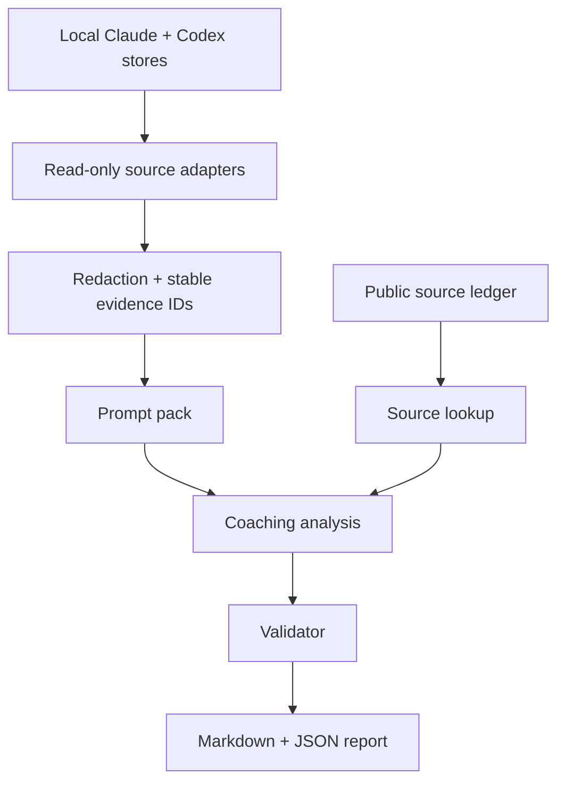

# ai-usage-review

`ai-usage-review` is a local-first coach for how you use AI.

It reads your local Claude and Codex sessions, looks primarily at what you asked
the AI to do, and writes a teaching report: what you are already good at, what
patterns show up in your prompts, where AI features may have helped, and what to
try in the next session.

The goal is not to grade you. The goal is to make your next AI session sharper.

## Why this exists

Most AI coding reviews look at the code. That misses a useful signal: the
operator's prompts often explain why the session went well or badly.

For example, a session can fail because the model wrote bad code. It can also
fail because the user asked for a broad change without a done state, never asked
for verification, or kept pushing the same model through a fix loop when a fresh
review would have helped.

This tool looks at that second layer.

## What it reads

The collector is read-only. It probes local stores for:

- Claude Code CLI project JSONL under `~/.claude/projects/`
- Claude history under `~/.claude/history.jsonl`
- Claude Desktop / Claude Code app session exports when the schema is visible
- Codex CLI/Desktop SQLite state under `~/.codex/state_*.sqlite`
- Codex rollout files referenced by matched threads
- Codex history entries that can be tied to matched project threads
- manual JSONL or Markdown imports

It collects user prompts, tool calls, model/effort metadata, timestamps,
session IDs, and project-matching metadata. Assistant prose is excluded from the
model-facing prompt pack by default.

## What it does not do

- It does not review code correctness. Use a code review tool for that.
- It does not score assistant output quality.
- It does not upload transcripts.
- It does not write memory, push to GitHub, open PRs, or modify your project.
- It does not claim complete desktop-app coverage when a vendor cache has no
  stable public export schema.

Those limits are intentional. A useful report should be clear about what it saw.

## How it works



The deterministic layer builds evidence, redacts private data, assigns stable
`ev-...` IDs, and validates citations. The coaching layer turns that evidence
into advice.

Every recommendation should point to both:

- an evidence ID from your local session, and
- a source ID from the public guidance ledger.

## Quick start

Download the standalone repo:

```bash
git clone https://github.com/<owner>/ai-usage-review.git
cd ai-usage-review
bun install
bun test
```

Use it directly:

```bash
bun run src/cli.ts status
bun run src/cli.ts review --project /path/to/project --since 21d --no-questions --no-second-opinion
```

For a local project:

```bash
bun run src/cli.ts review \
  --project ~/Developer/Projects/my-app \
  --since 21d \
  --no-questions \
  --no-second-opinion
```

Reports are written under:

```text
~/.ai-usage-review/projects/<project-slug>/runs/<timestamp>/
```

The main file to read is `report.md`.

## Commands

```bash
ai-usage-review status
ai-usage-review collect --project <path> --since 21d
ai-usage-review analyze --run <run-dir>
ai-usage-review second-opinion --run <run-dir> --provider auto
ai-usage-review validate --run <run-dir>
ai-usage-review render --run <run-dir>
ai-usage-review review --project <path> --since 21d
```

During local development, use `bun run src/cli.ts ...` instead of the global
`ai-usage-review` binary.

## Install as a Codex skill

The repo root is also a complete Codex skill: `SKILL.md`, `agents/openai.yaml`,
`references/`, and the CLI all live together.

From the downloaded repo:

```bash
bun run install:codex
```

That copies the skill to:

```text
${CODEX_HOME:-~/.codex}/skills/ai-usage-review
```

After that, ask Codex:

```text
Use ai-usage-review to review this project for the last 21 days.
```

The skill will use the installed local CLI. It does not need GStack.

## Package a local copy

To build a clean distributable folder:

```bash
bun run pack:skill
```

The package is written to:

```text
dist/ai-usage-review/
```

This excludes `.git`, `node_modules`, test output, and local run artifacts.

## Output artifacts

Each run can write:

```text
manifest.json
evidence.normalized.jsonl
prompt-pack.md
primary-analysis.json
second-opinion.json
second-opinion-prompt.md
report.json
report.md
```

`evidence.normalized.jsonl` and `prompt-pack.md` contain redacted evidence. Raw
transcripts stay in the original local Claude/Codex stores.

## Guidance sources

The default source ledger uses public guidance only:

- Anthropic Claude Code docs for subagents, hooks, common workflows, and memory
- OpenAI docs for code generation, Codex, Codex use cases, and Docs MCP
- the public AGENTS.md spec

Private notes can be used as local overlays later, but they should not be
committed to the public repo.

## Second opinion

Second opinion is optional. It is meant to be a critique of the primary report,
not a second full report.

It asks the other model family:

1. What did the primary coach overstate?
2. What important pattern did it miss?
3. Which recommendation is weakest?
4. Which recommendation is strongest?
5. What should the user focus on next session?

By default this path is budget-gated and local: the CLI writes
`second-opinion-prompt.md` rather than making a paid model call.

## Writing standard

The docs and reports should follow the same standard as the best Claude Code
engineering posts:

- start from the real problem, not a feature list
- explain the system shape before the details
- give concrete examples
- distinguish observed evidence from interpretation
- name limits directly
- avoid hype, flattery, and compliance language

The report should feel like a coach reading your actual prompts with you, not a
static lint pass over a few fixed rules.

## Development

```bash
bun test
bun run typecheck
bun run lint
```
